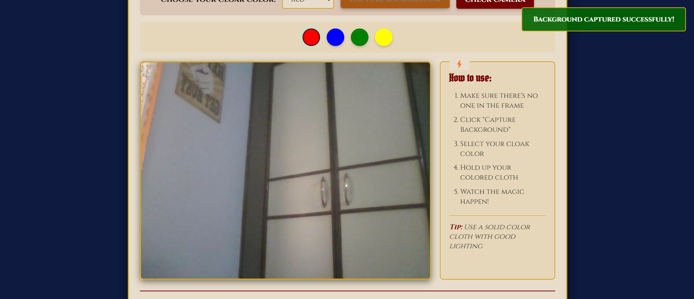
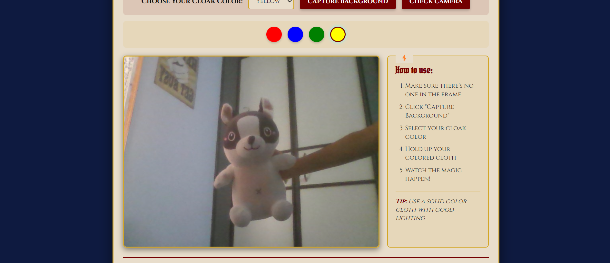
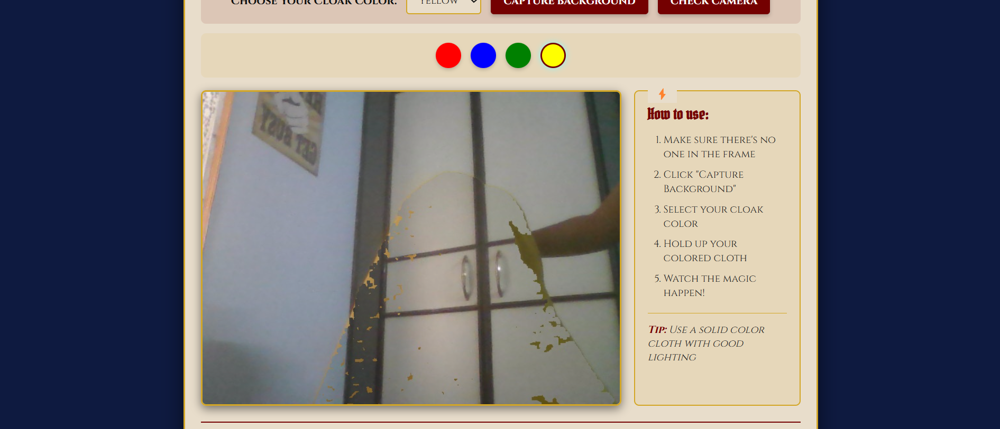

# 🧥 Invisibility Cloak using Color Detection and Segmentation

A fun and magical project that makes you invisible — just like Harry Potter!  
Using OpenCV and Python, this project detects a specific colored cloak and replaces it with the background, creating an invisibility illusion.

## ✨ Demo

| Background Captures | Sample Image | Final Frame |
|----------------|---------------------|-------------|
|  |  |  |


## 🚀 Features

- Real-time color detection using OpenCV
- Background capture & segmentation
- Cloak masking and bitwise image manipulation
- Fully written in Python with a simple UI using Flask (optional)

## 🧠 How It Works

1. Capture background for a few seconds.
2. Detect the specific color of the cloak (e.g., red, blue, green).
3. Create a mask for the cloak and remove it from the frame.
4. Replace the cloak area with the static background.
5. Display the final result in real-time.

<!-- ## 📁 Project Structure

├── cloak.py # Main script for the invisibility effect ├── static/ # Static files (CSS, captured images if any) ├── templates/ # HTML templates for UI ├── app.py # Flask app (optional for GUI) └── README.md # This file! -->


## 🛠️ Requirements

- Python 3.x
- OpenCV
- NumPy
- Flask *(optional)*

Install all dependencies:

```bash
pip install opencv-python numpy flask
``` 

## ▶️How to Run

1. Clone the repository

```bash
git clone https://github.com/yourusername/invisible-cloak
cd invisible-cloak
```

2. Run the application

```bash
python app.py
```

3. Visit the app in your browser

http://localhost:5000/
